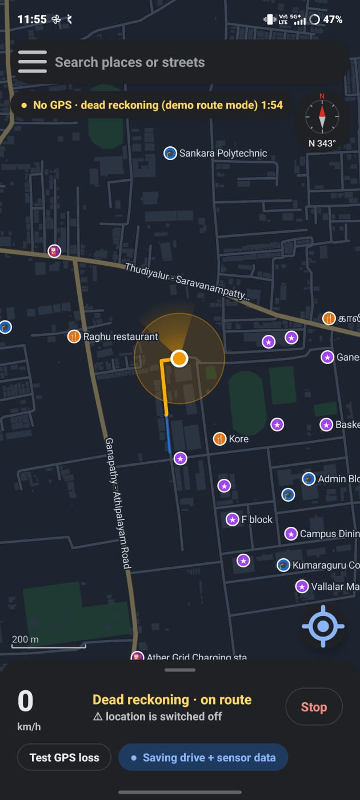
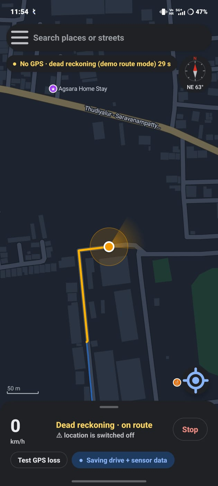
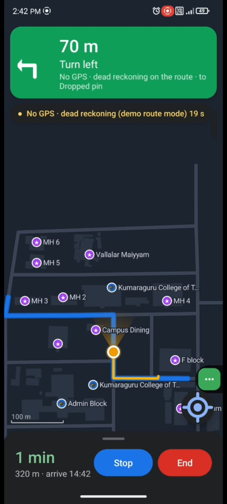

# Maverick — AI-Powered Dead Reckoning for GNSS-Denied Navigation

> **Smart India Hackathon 2026 · Problem Statement 26168 (ISRO / Department of Space)**
> *AI-ML based Intelligent Dead Reckoning system for seamless navigation*
> **Team Maverick · Kumaraguru College of Technology, Coimbatore**

<p align="center">
  
  
  
</p>

<p align="center">
  
  
  
  
  
</p>

---

## Table of Contents
1. [The Problem](#the-problem)
2. [What Maverick Does](#what-maverick-does)
3. [Key Results](#key-results)
4. [App Screenshots — Field Testing](#app-screenshots--field-testing)
5. [How It Works](#how-it-works)
6. [Innovation](#innovation)
7. [App Features](#app-features)
8. [Dataset & Validation](#dataset--validation)
9. [Repository Structure](#repository-structure)
10. [Getting Started](#getting-started)
11. [Drive Reports & Data Logging](#drive-reports--data-logging)
12. [Limitations & Honest Notes](#limitations--honest-notes)
13. [Roadmap](#roadmap)
14. [References](#references)
15. [Team](#team)

---

## The Problem

GNSS fails exactly where it matters: **tunnels, flyovers, underpasses, basements, dense urban canyons**. Navigation freezes or jumps, and vehicles, fleets and emergency services lose their position when they need it most. Commercial INS solutions need extra hardware (wheel-speed sensors, OBD, tactical-grade IMUs) that most vehicles in India do not have.

**Goal (PS 26168):** keep a vehicle's position accurate through GNSS outages using AI-ML dead reckoning, and hand back seamlessly when GNSS returns — target **< 10 % drift** of distance travelled.

---

## What Maverick Does

**Maverick is an Android app that keeps navigating when GNSS fails, using only the phone's own sensors and offline road maps.**

- ❌ No extra hardware  ❌ No internet  ❌ No calibration stop
- ✅ Works on any Android 10+ phone
- ✅ Cars **and** two-wheelers
- ✅ Instant switch to dead reckoning the moment GNSS is lost
- ✅ Smooth handover when GNSS returns
- ✅ Every drive tests itself and saves an accuracy report

---

## Key Results

Validated on **held-out drives** of the **IO-VNBD** dataset (leave-one-drive-out cross-validation), median drift as % of distance travelled during the outage:

| GNSS outage length | Hold-last-speed baseline | **Maverick (phone IMU only)** | Target |
|---|---|---|---|
| 30 s  | — | **9.7 %** | < 10 % ✅ |
| 60 s  | — | **6.6 %** | < 10 % ✅ |
| 120 s | — | **6.0 %** | < 10 % ✅ |

- **~6× lower drift** than the hold-last-speed baseline
- **Auto gyro-bias learning halved the heading error** at 120 s
- The **"last GNSS speed + learned correction"** speed model beat every other model tested, including a neural network
- Engine runs **fully offline on the phone at 10 Hz**
- Results were reproduced independently on a second machine with identical numbers

> Fill in the baseline column from `Maverick_Report_v4` before publishing.

---

## App Screenshots — Field Testing

All screenshots below are from **real rides on the Kumaraguru College of Technology campus and Thudiyalur–Saravanampatty Road, Coimbatore**, with the phone's **Location switched off**.

### 1 · Turn-by-turn navigation with no GNSS
<p align="center"></p>

| What you see | What it means |
|---|---|
| **"70 m · Turn left — No GPS · dead reckoning on the route"** | Voice + visual turn-by-turn guidance keeps working with zero GNSS |
| **Orange trail** | Path estimated by dead reckoning |
| **Blue line** | Planned route (offline A* routing on the OSM road graph) |
| **"1 min · 320 m · arrive 14:42"** | ETA and distance are still computed during the outage |
| Campus labels (MH 2–6, Campus Dining, F block, Admin Block) | Offline vector map with POIs, no internet |

### 2 · 29 seconds into GNSS loss — taking a junction
<p align="center"></p>

| What you see | What it means |
|---|---|
| **"No GPS · dead reckoning … 29 s"** | Outage timer — engine switched instantly, no stop |
| **"⚠ location is switched off"** | Phone GNSS is fully disabled — position comes only from IMU + AI + map |
| **Heading NE 63°** + orange cone | Gyro-integrated heading; cone shows direction of travel |
| **Right turn locked onto the road** | Particle filter snaps the estimate to OSM geometry |
| **Uncertainty circle** | Particle spread — honest confidence of the estimate |

### 3 · 1 minute 54 seconds into GNSS loss — still on the road
<p align="center"></p>

| What you see | What it means |
|---|---|
| **"No GPS · dead reckoning … 1:54"** | Nearly 2 minutes without any GNSS |
| **Heading N 343°** | Heading tracked through multiple turns |
| **"Dead reckoning · on route"** | Map-matching confirms the estimate is still on a valid road |
| **"Saving drive + sensor data"** | 50 Hz IMU + trajectory logged for reports and retraining |
| **200 m scale** | Full trajectory view from start of outage |

> 📌 These screenshots were recorded in **demo route mode** (see [Limitations](#limitations--honest-notes)).

---

## How It Works

```
                ┌──────────────── GNSS HEALTHY ────────────────┐
 Phone sensors  │  • Align phone axes to vehicle frame         │
 (accel, gyro,  │  • Learn gyro bias at every ordinary stop    │
  magnetometer) │  • Build vehicle speed profile               │
      +         │  • Learn stop-detector threshold per vehicle │
 GNSS fixes ───►└──────────────────────┬───────────────────────┘
                                       │  GNSS lost (instant switch)
                                       ▼
          ┌─────────────────── DEAD RECKONING ───────────────────┐
          │  SPEED   = last GNSS speed + LightGBM correction     │
          │            (learned from IMU vibration + speed hist.)│
          │  HEADING = gyro integration − learned bias           │
          │  STOP    = LightGBM stop detector + turn-veto rule   │
          │  POSITION= 400-particle filter on OSM road graph     │
          │            (one-way aware, no sideways drift)        │
          └──────────────────────┬──────────────────────────────┘
                                 │  GNSS returns
                                 ▼
                 Smooth handover → drive report (drift, MAE, RMSE, R²)
```

### Pipeline stages
1. **Sensor ingestion** — accelerometer, gyroscope, magnetometer and GNSS at up to 50 Hz.
2. **Frame alignment** — phone axes rotated into the vehicle frame while GNSS is healthy (no mounting constraint beyond being fixed to the vehicle).
3. **Zero-stop calibration** — gyro bias re-estimated every time the vehicle stops normally; no dedicated calibration stop.
4. **AI speed model** — LightGBM predicts the *correction* to the last known GNSS speed from IMU vibration features and pre-outage speed history.
5. **Heading** — bias-corrected gyro yaw integration.
6. **Map matching** — 400-particle filter constrained to OpenStreetMap road geometry and direction.
7. **Handover** — blends back to GNSS without jumps when fixes return.

---

## Innovation

| # | Idea | Why it matters |
|---|---|---|
| 1 | **Phone-only dead reckoning** | No wheel-speed sensor, OBD or external IMU — deployable to any Android phone today |
| 2 | **Speed anchored to last GNSS fix + learned correction** | Beat every alternative tested, including a neural network |
| 3 | **Zero-stop calibration** | Gyro bias learned at ordinary stops — halved heading error at 120 s |
| 4 | **Map-locked particle filter** | Knows one-way roads; estimate can't drift sideways off the road |
| 5 | **Self-testing engine** | A hidden twin engine cuts GNSS for 60 s every 3 min and reports drift / MAE / RMSE on every drive |
| 6 | **Per-vehicle learning** | Stop threshold, speed pattern and learned roads adapt to each car or bike |

---

## App Features

- 🗺️ **Offline vector maps** (OpenStreetMap) with rotation and heading-up mode
- 🔍 **Offline place & street search**
- 🧭 **Offline routing** (A* on the OSM road graph) with **turn-by-turn voice guidance**
- 📡 **Automatic GNSS-loss detection** + instant dead-reckoning switch
- 🧪 **"Test GPS loss" button** — withholds every GNSS fix from the engine for live accuracy demos
- 🎯 **Uncertainty circle** from particle spread
- 🚗🏍️ **Vehicle chooser** — car and two-wheeler profiles
- 📊 **Drive reports** — PNG chart + CSV / GeoJSON / GPX, saved to `Documents/Maverick/`
- 📈 **50 Hz sensor logger** for building training data
- 🌗 **Dark / light mode**
- ☕ **Pure Java, no third-party libraries**

---

## Dataset & Validation

**IO-VNBD** — *Inertial and Odometry Benchmark Dataset for Ground Vehicle Positioning* (Onyekpe et al.): ~58 hours / ~4,400 km of smartphone and vehicle driving data.

**Data audit findings (fixed before training):**
- Phone GPS speed column was mislabelled (m/s stored under "Kmh")
- Phone GPS updates only every ~9 s with ~4.5 s lag
- "Synchronised" phone/vehicle files had time offsets of up to minutes
- Only a few drives had a usable phone gyroscope

**Protocol:**
- Leave-one-drive-out cross-validation
- Driver B drives (set **M**) held out as the final test set
- Synthetic GNSS outages of **30 / 60 / 120 s** inserted into held-out drives
- Metric: median final-position drift as % of distance travelled during the outage

**Own field data:** phone logs collected on a two-wheeler (phone mounted on top of the engine) using our companion data-collection app **MAVEMap**.

---

## Repository Structure

> Adjust to match the actual repo.

```
Maverick/
├── app/                      # Android app (Java)
│   ├── engine/               # dead reckoning, particle filter, speed model runtime
│   ├── map/                  # offline OSM rendering, search, A* routing
│   ├── nav/                  # turn-by-turn + voice guidance
│   └── report/               # drive reports, CSV/GeoJSON/GPX export
├── idr/                      # Python evaluation harness + model training
├── models/                   # exported LightGBM models
├── docs/
│   ├── screenshots/          # app screenshots used in this README
│   └── Maverick_Report_v4.pdf
└── README.md
```

---

## Getting Started

### Run the app
1. Clone the repo and open it in **Android Studio**.
2. Connect an **Android 10+** phone with USB debugging enabled.
3. **Run ▶** to install.
4. Download / load the offline OSM map for your area.
5. Choose your vehicle (car / bike) and fix the phone firmly to the vehicle.
6. Start a drive with GNSS on — Maverick calibrates itself while moving.
7. Tap **Test GPS loss** (or drive under a flyover/tunnel) to see dead reckoning take over.

### Reproduce the evaluation
```bash
cd idr
pip install -r requirements.txt
python evaluate.py --dataset /path/to/IO-VNBD --outages 30 60 120
```

> Replace the commands above with the exact entry points in `idr/`.

---

## Drive Reports & Data Logging

Every drive is saved to `Documents/Maverick/drive_YYYYMMDD_HHMMSS/`:

| File | Contents |
|---|---|
| `report.png` | Trajectory + error chart with **drift, MAE, RMSE, R²** |
| `summary.json` | Numeric metrics |
| `*.csv` | 50 Hz sensor + estimate log |
| `*.geojson`, `*.gpx` | Trajectories for QGIS / Google Earth |
| `info.txt` | Device, vehicle and session metadata |

---

## Limitations & Honest Notes

- **Needs one GNSS fix at the start.** Dead reckoning estimates motion *relative to* a known position; Maverick bridges GNSS gaps, it does not start from nothing.
- **Demo route mode (used in the screenshots above)** follows the planned route with a scripted speed profile (35 km/h, 20 km/h in turns) so demo videos are repeatable. It demonstrates the UI, map-lock and navigation flow — **accuracy claims come from the IO-VNBD evaluation and "Test GPS loss" drives, not demo mode.**
- **Smooth two-wheelers:** the car-trained stop detector sometimes classified smooth motion as stopped; mitigated with adaptive per-vehicle stop thresholds and a turn-veto rule, still being improved with more bike data.
- Accuracy depends on the phone being **rigidly mounted**.
- Off-road / unmapped areas lose the map-matching benefit.

---

## Roadmap

- [ ] "Start here without GPS" — manual start point for fully GNSS-free starts
- [ ] Two-wheeler-specific speed & stop models trained on MAVEMap data
- [ ] Barometer fusion for flyovers and multi-level parking
- [ ] Android Auto / fleet dashboard integration
- [ ] NavIC (IRNSS) support for the handover stage

---

## References

1. U. Onyekpe et al., *IO-VNBD: Inertial and Odometry Benchmark Dataset for Ground Vehicle Positioning*, Data in Brief, 2021. [DOI](https://doi.org/10.1016/j.dib.2021.106885) · [arXiv](https://arxiv.org/abs/2005.01701)
2. U. Onyekpe et al., *WhONet: Wheel Odometry Neural Network for Vehicular Localisation in GNSS-Deprived Environments*, 2021. [DOI](https://doi.org/10.1016/j.engappai.2021.104421) · [arXiv](https://arxiv.org/abs/2104.02581)
3. M. Brossard, A. Barrau, S. Bonnabel, *AI-IMU Dead-Reckoning*, IEEE T-IV, 2020. [arXiv](https://arxiv.org/abs/1904.06064) · [Code](https://github.com/mbrossar/ai-imu-dr)
4. H. Yan, S. Herath, Y. Furukawa, *RoNIN: Robust Neural Inertial Navigation in the Wild*, ICRA 2020. [arXiv](https://arxiv.org/abs/1905.12853) · [IEEE Xplore](https://ieeexplore.ieee.org/abstract/document/9196860) · [Project page](https://ronin.cs.sfu.ca/)
5. P. Newson, J. Krumm, *Hidden Markov Map Matching Through Noise and Sparseness*, ACM SIGSPATIAL, 2009. [DOI](https://doi.org/10.1145/1653771.1653818) · [Microsoft Research](https://www.microsoft.com/en-us/research/publication/hidden-markov-map-matching-noise-sparseness/)
6. P. D. Groves, *Principles of GNSS, Inertial, and Multisensor Integrated Navigation Systems*, 2nd ed., Artech House, 2013. ISBN 978-1-60807-005-3. [Publisher](https://us.artechhouse.com/Principles-of-GNSS-Inertial-and-Multisensor-Integrated-Navigation-Systems-Second-Edition-P2046.aspx)
7. G. Ke et al., *LightGBM: A Highly Efficient Gradient Boosting Decision Tree*, NeurIPS 2017. [Paper (PDF)](https://proceedings.neurips.cc/paper/2017/file/6449f44a102fde848669bdd9eb6b76fa-Paper.pdf)
8. OpenStreetMap contributors — © OpenStreetMap, [ODbL](https://opendatacommons.org/licenses/odbl/). [Copyright and license](https://www.openstreetmap.org/copyright)

---

---

<p align="center"><i>Navigation that doesn't stop when the sky disappears.</i></p>
